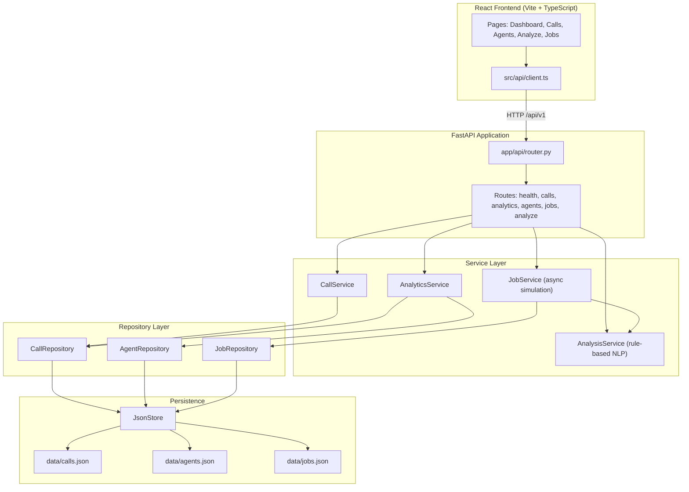

# Conversation Insights

Enterprise-style portfolio application for **AI voice call analytics**. Explore synthetic call transcripts, agent performance metrics, sentiment trends, booking rates, keyword extraction, and a simulated background job queue — all powered by a layered FastAPI backend and a React dashboard.

> All data is synthetic mock data. No real customer or company information is used.

---

## Architecture



---

## Project Structure

```
conversation-insights/
├── app/
│   ├── main.py                     # FastAPI app factory & CORS
│   ├── core/
│   │   ├── config.py               # Pydantic settings
│   │   └── database.py             # JsonStore (thread-safe JSON persistence)
│   ├── models/
│   │   └── schemas.py              # Pydantic request/response models
│   ├── repositories/
│   │   ├── call_repository.py
│   │   ├── agent_repository.py
│   │   └── job_repository.py
│   ├── services/
│   │   ├── call_service.py         # Filtering & pagination
│   │   ├── analytics_service.py    # Dashboard & agent metrics
│   │   ├── analysis_service.py     # Rule-based mock NLP
│   │   └── job_service.py          # Async job simulation
│   └── api/
│       ├── router.py
│       └── routes/
│           ├── health.py
│           ├── calls.py
│           ├── analytics.py
│           ├── agents.py
│           ├── jobs.py
│           └── analyze.py
├── data/
│   ├── calls.json                  # 20 synthetic call records
│   ├── agents.json                 # 6 agent profiles
│   └── jobs.json                   # Sample background jobs
├── frontend/
│   ├── src/
│   │   ├── api/client.ts           # Typed API client
│   │   ├── types/index.ts
│   │   ├── components/Layout.tsx
│   │   └── pages/
│   │       ├── Dashboard.tsx
│   │       ├── Calls.tsx
│   │       ├── Agents.tsx
│   │       ├── Analyze.tsx
│   │       └── Jobs.tsx
│   ├── vite.config.ts              # Dev proxy to backend
│   ├── Dockerfile
│   └── nginx.conf
├── docker-compose.yml
├── Dockerfile                      # Backend container
├── requirements.txt
└── README.md
```

---

## Layer Responsibilities

| Layer | Responsibility |
|-------|----------------|
| **API Routes** | HTTP validation, status codes, route wiring — no business logic |
| **Services** | Business rules: analytics aggregation, NLP analysis, async job orchestration |
| **Repositories** | Data access abstraction over JSON files |
| **JsonStore** | Thread-safe read/write for file-based persistence |
| **Frontend** | Dashboard UI, filters, charts (Recharts), job polling |

---

## Quick Start

### Option 1: Docker Compose (recommended)

```bash
docker compose up --build
```

- Frontend: http://localhost:8080
- Backend API: http://localhost:8000
- Swagger docs: http://localhost:8000/docs

### Option 2: Local development

**Backend**

```bash
python -m venv .venv
.venv\Scripts\activate        # Windows
pip install -r requirements.txt
uvicorn app.main:app --reload --port 8000
```

**Frontend**

```bash
cd frontend
npm install
npm run dev
```

Open http://localhost:5173 — Vite proxies `/api` requests to the backend.

---

## API Reference

Base URL: `/api/v1`

| Method | Endpoint | Description |
|--------|----------|-------------|
| `GET` | `/health` | Service health & data file status |
| `GET` | `/calls` | List calls (filter by agent, outcome, sentiment, search) |
| `GET` | `/calls/{id}` | Get single call with full transcript |
| `GET` | `/agents` | List all agents |
| `GET` | `/agents/{id}` | Get agent profile |
| `GET` | `/analytics/dashboard` | Dashboard KPIs, charts data, leaderboard |
| `GET` | `/analytics/agents/{id}` | Agent-specific metrics & trends |
| `POST` | `/analyze` | Synchronous transcript analysis |
| `GET` | `/jobs` | List background jobs (optional `?status=`) |
| `GET` | `/jobs/{id}` | Get job details & result |
| `POST` | `/jobs` | Enqueue a new simulated background job |

### Example: Analyze a transcript

```bash
curl -X POST http://localhost:8000/api/v1/analyze \
  -H "Content-Type: application/json" \
  -d "{\"transcript\": \"Customer: I want to schedule an appointment for tomorrow. Agent: Confirmed at 10 AM. Customer: Thank you!\"}"
```

### Example: Enqueue a batch job

```bash
curl -X POST http://localhost:8000/api/v1/jobs \
  -H "Content-Type: application/json" \
  -d "{\"job_type\": \"batch_analysis\", \"payload\": {\"call_ids\": [\"call-1001\", \"call-1002\"]}}"
```

---

## Features

- **Dashboard** — booking rate, sentiment averages, daily call volume, keyword frequency, agent leaderboard
- **Call Explorer** — searchable transcript browser with outcome/sentiment filters
- **Agent Performance** — per-agent booking rate, handle time, sentiment trend charts
- **Transcript Analysis** — rule-based mock NLP (sentiment, keywords, booking intent, risk flags)
- **Job Queue** — simulated async workers with progress tracking and auto-refresh

---

## Technology Stack

| Component | Technology |
|-----------|------------|
| Backend | Python 3.12, FastAPI, Pydantic v2, Uvicorn |
| Frontend | React 18, TypeScript, Vite, React Router, Recharts |
| Persistence | JSON files via custom JsonStore |
| Containers | Docker, Docker Compose, Nginx |

---

## Design Notes

- **Layered architecture** keeps routes thin and pushes logic into services for testability and clarity.
- **JsonStore** simulates a database layer without external dependencies — suitable for portfolio demos.
- **AnalysisService** uses deterministic keyword/phrase rules instead of ML models — fast, explainable, and fully offline.
- **JobService** uses `asyncio.create_task` to simulate background processing with incremental progress updates.

---

## License

MIT — portfolio demonstration project.
